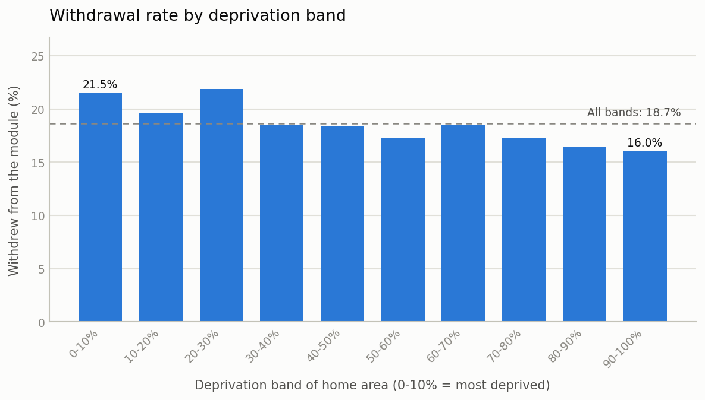
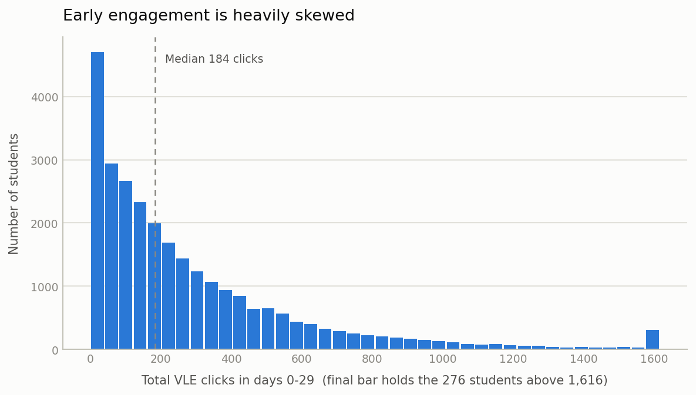

# Early engagement and student outcomes

## The question and the answer

Do students who use the online course site more in their first month go on to
continue and attain better than students who use it less, once we allow for
their background? Using the Open University Learning Analytics Dataset, the
answer is yes, and the association is large. Among students still enrolled at
day 30, moving from the quieter quarter of the group to the busier quarter is
associated with about 5 percentage points lower withdrawal and about 16
percentage points higher chance of passing. The association holds after
allowing for area deprivation, prior qualification, age, disability, previous
attempts, and course load. It is an association, not a demonstrated cause.
Students who were already committed will click more and also do better for
reasons this data cannot see. The practical read is that very low activity in
the first month is a usable early warning sign, not that clicks themselves
produce results.

## Data and method

The Open University Learning Analytics Dataset covers 32,593 student records
across 7 modules and 22 module-presentations, from 2013 and 2014. It is
published under CC-BY 4.0.

Each row is one student on one module-presentation. Early engagement is the
total number of clicks on the online course site between day 0 and day 29.
Three outcomes are measured: whether the student withdrew, whether they passed
or gained a distinction, and their mean assessment score weighted by how much
each assessment counted.

Students who left the module before day 30 are excluded, because their click
count was cut short by the withdrawal itself, which would make low engagement
look like a cause of an outcome that had in fact already happened. That removes
5,067 records and leaves 27,526.

Two models use logistic regression, which is the standard method for a yes or
no outcome and reports results as odds ratios. An odds ratio above 1 means the
outcome is more likely; below 1, less likely. The third uses linear regression
for the score, reported in marks. Each model includes a separate adjustment for
every module-presentation, so students are compared with others on the same
course in the same term rather than across different courses. Standard errors
are clustered by student, because some students appear on more than one module.

## Results

Withdrawal is more common among students from more deprived areas, though the
pattern across the middle bands is uneven.



Withdrawal is highest among students from the most deprived areas (21.5%) and
lowest among those from the least deprived (16.0%), a gap of 5.5 percentage
points, though the decline across the middle bands is uneven rather than
steady.

Early engagement itself is very unevenly spread.



Most students click a few hundred times in the first month, the median being
184, but the spread is wide and 1,197 students (4.3%) record no clicks at all.

### What the models show

Each extra 100 clicks in the first 30 days is associated with:

| Outcome | Result | 95% confidence interval |
|---|---|---|
| Withdrawing | 11% lower odds (odds ratio 0.89) | 0.87 to 0.90 |
| Passing | 28% higher odds (odds ratio 1.28) | 1.26 to 1.30 |
| Mean score | 1.1 more marks | 1.01 to 1.18 |

A confidence interval is the range the true figure is likely to sit in. None of
these three ranges includes "no difference", so the patterns are unlikely to be
chance.

Translated into rates for the actual student population:

| Clicks in first 30 days | Predicted withdrawal | Predicted pass |
|---|---|---|
| 0 | 23.9% | 40.6% |
| 100 | 21.9% | 46.1% |
| 200 | 20.0% | 51.6% |
| 400 | 16.6% | 62.5% |
| 800 | 11.1% | 80.5% |

A quarter of students record fewer than 70 clicks and a quarter more than 388.

The pattern is not evenly spaced. Splitting students into five equal groups by
engagement, the largest single difference in pass rates is between the lowest
fifth and the second lowest. If the aim is to target support, the students who
are barely using the site at all are where the sharpest difference lies.

Background still matters after engagement is taken into account. Students from
the least deprived areas have about twice the odds of passing as those from the
most deprived, and score about 6 marks higher. Adding engagement to the model
does not remove the deprivation gap, so engagement is not the route by which
deprivation is operating in this data.

## Limits of the evidence

**This cannot show cause.** Students choose how much to engage. Motivation,
confidence, health, caring responsibilities, and hours of paid work are not in
this dataset, and any of them could produce both higher engagement and better
outcomes. A student who was going to succeed anyway also clicks more. Some
unknown share of the association reported here is that, not engagement doing
work of its own.

**The sample excludes the students who left earliest.** Removing the 5,067 who
unregistered before day 30 was necessary, but it is not a neutral act. In the
full file 31.2% of records are withdrawals; in the analysis sample it is 18.5%.
The findings describe students who made it past the first month, and say
nothing about the ones who left before that. For an access and participation
audience those very early leavers may be the group of most interest, and this
analysis does not reach them.

**Deprivation band is missing for 1,111 students, and not at random.** The
missing records are concentrated in two places: 44% of North Region students
and 23% of Ireland students have no band recorded, against almost none
elsewhere. The index is a jurisdiction-specific measure, so this is structural
rather than careless recording. Those students drop out of every model that
includes deprivation, so the two regions are under-represented in the results.

**The pass model overlaps the withdrawal model.** A student who withdrew cannot
pass, so the pass outcome combines continuing and attaining. Its result is not
separate confirmation of the withdrawal result.

**Most variation is unexplained.** Engagement and the six background variables
together account for about 19% of the variation in scores. Four-fifths is
driven by things not measured here.

**Clicks are a crude measure.** One click is counted the same whether it opened
a reading for an hour or was a mis-click. The measure does not distinguish
between types of activity, and does not capture study done offline.

**The data is from 2013 and 2014 at one institution.** The Open University is
distance-taught and its students differ from a campus population in age, mode
of study, and prior qualification. The size of these associations should not be
assumed to carry across to Reading.

**What was not done.** Propensity score matching was not carried out, so there
is no check on whether the regression result survives a different way of
comparing similar students. February and October starts were not modelled
separately; instead each module-presentation has its own adjustment, which
absorbs the difference between them but does not test whether the engagement
association itself differs by start month. Neither would change the causal
standing of the result.

## How to reproduce the analysis

Requires Python 3.12 or later.

```
python3 -m venv .venv
.venv/bin/pip install -r requirements.txt

.venv/bin/python -m src.data       # download, verify, and summarise the data
.venv/bin/python -m src.clean      # build the analysis table, print exclusions
.venv/bin/python -m src.describe   # write the charts into outputs/
.venv/bin/python -m src.models     # fit the three models
```

The first step downloads about 45 MB and checks it against a known checksum, so
a truncated or altered file is rejected rather than analysed. The data is not
stored in this repository.

The dataset is documented at https://analyse.kmi.open.ac.uk/open_dataset. That
page no longer serves the archive; the same file, deposited by the dataset
authors, is retrieved from the UC Irvine Machine Learning Repository, dataset
349.

`notebooks/analysis.ipynb` walks through the analysis in order. The working
code lives in `src/`.
