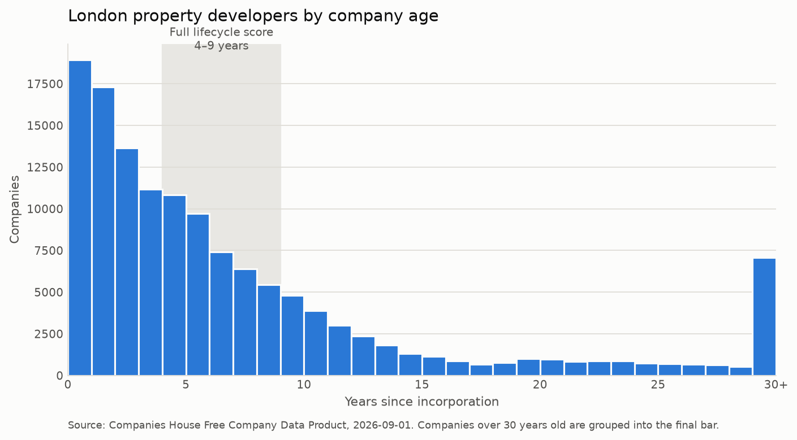

# Which 25 UK property developers should a sales team call first?

An ideal-customer-profile and target-account model built on the Companies House public register.
It takes 5.7 million UK companies, narrows them to a defined segment, ranks that segment by how
good a prospect each account is, and ends with three outbound emails written to the top three —
each citing a specific fact from the data about that company.

**Worked example:** a land-sourcing and planning-intelligence product sold to UK property
developers, the segment [LandTech](https://land.tech), Orbital and Searchland compete in. Naming
the vendor matters — "good prospect" is meaningless on its own, and every weighting decision in
this repository is an argument about *this* buyer.

---

## The scoring logic, in five lines

| Component | Weight | Question it answers |
|---|---|---|
| **Industry fit** | 35 | Is this the right *sort* of company? Graded by SIC code, not binary. |
| **Lifecycle fit** | 25 | Are they at the stage where this problem bites? A trapezoid over company age. |
| **Commercial substance** | 25 | Can they actually buy anything? Accounts size class plus live development finance. |
| **Filing health** | 15 | Would a salesperson waste a morning here? Overdue filings as a disqualifier. |

Each component scores 0–1; the weights sum to 100, so the total needs no normalisation.

**It is a weighted rank, not a model, and that is a decision rather than a shortcut.** Nobody has
labelled which of these companies actually bought software, so there is no target variable to train
against — a fitted model here would be a confident-looking guess carrying a validation score that
measures nothing. A transparent score a sales team will argue with beats an opaque one they quietly
ignore.

## Results

| | |
|---|---|
| Companies scanned | 5,689,367 |
| Passed the segment filter | 156,107 |
| Sibling SPVs folded into parents | 19,565 |
| **Sellable accounts ranked** | **136,542** |
| Distinct scores | 807 |



**Top 5 accounts:**

| # | Company | Age | Accounts | Live charges | Group | Score |
|---|---|---|---|---|---|---|
| 1 | Sibner Group Ltd | 4.3 | GROUP | 3 | 2 | 100.0 |
| 2 | DSBL HMO Portfolio Limited | 6.2 | GROUP | 4 | 32 | 100.0 |
| 3 | Kajima Student Housing Limited | 7.4 | FULL | 5 | 16 | 98.4 |
| 4 | Urban&Civic Corby Limited | 8.9 | FULL | 8 | 42 | 98.4 |
| 5 | KHK One Limited | 5.9 | FULL | 4 | 4 | 98.4 |

Full ranking in [`outputs/scored_segment.csv`](outputs/), top 25 in
[`outputs/top_25.csv`](outputs/).

## Two problems found by running it

Both were discovered by looking at the output rather than by planning, and both are documented in
the notebooks rather than quietly fixed.

**4,401 companies tied at exactly 100.0.** The first version scored industry, lifecycle and filing
health only. All three describe whether a company is the *right sort*; none describe whether it is
big enough to have a budget. A "top 25" drawn from a 4,401-way tie is alphabetical noise wearing the
costume of a ranking. Adding commercial substance — the statutory accounts size class, plus
outstanding mortgage charges as a live-development-finance signal — cut the tie from 4,401 to 2.

**The top of the list was one developer, five times.** `PEARL MK 340`, `PEARL MK 330`,
`PEARL LUTTERWORTH 4400` — all at one Mayfair address. Developers incorporate one company per
scheme to ring-fence finance, so the register is full of special-purpose vehicles. You cannot sell
software to an SPV: it has no staff, no budget and no systems. Collapsing on name stem *and*
registered address folded 19,565 siblings into their parents — and the sibling count turned out to
be the most useful field in the output, because a developer running 42 SPVs is running 42 schemes.

## A domain judgement worth flagging

**Outstanding mortgage charges are treated as a positive signal. This inverts the standard
convention, and the inversion is deliberate.**

Conventionally, charges registered at Companies House are a risk marker — debt secured against
company assets, ranking any new lender behind existing secured creditors. Credit reference agencies
read a rising charge count as rising leverage, and lenders are measurably less willing to extend
further credit to a company carrying several. On a credit report, five outstanding charges is bad
news.

But this is not a credit assessment. The question here is *is this company worth an hour of a
salesperson's time*, not *will this company repay a loan* — and charges point in opposite directions
for those two questions. Development finance is how development is funded: each live charge roughly
corresponds to a site being built right now. **A developer with five live charges is a worse credit
risk and a better prospect, and both are true simultaneously.** One with none is usually dormant,
tiny, or sitting on land it isn't developing.

The cost of the inversion, stated plainly: an over-leveraged developer heading for administration
looks identical to a busy one on this signal. Filing health catches the subset that stops filing, but
a company can be distressed and still file on time. This score prioritises a call list — it is not a
qualification decision, and shouldn't be used as one where the vendor carries payment risk.

## Layout

| File | |
|---|---|
| [`1. data_acquisition.ipynb`](1.%20data_acquisition.ipynb) | The data source, why the bulk file rather than the API, the three segment gates |
| [`2. scoring_model.ipynb`](2.%20scoring_model.ipynb) | Each component explained and demonstrated, with the reasoning behind every boundary |
| [`3. target_list.ipynb`](3.%20target_list.ipynb) | The SPV problem, the chart, the ranked top 25 |
| [`4. outbound_emails.ipynb`](4.%20outbound_emails.ipynb) | Three emails, and why none of them is a mail merge |
| `config.py` | Every targeting decision, in one file |
| `scoring.py` | The four components as pure functions |
| `get_data.py` · `pipeline.py` · `chart.py` | Download and filter · score and rank · the one chart |
| `test_scoring.py` · `test_pipeline.py` | **42 tests**, each named for the commercial case it encodes |

## Running it

```bash
python -m venv .venv && .venv/Scripts/activate     # Windows
pip install -r requirements.txt

python get_data.py     # downloads 493 MB, filters to data/segment.csv — once
python pipeline.py     # scores and ranks — seconds
python chart.py        # writes outputs/segment_age.png
python -m pytest -q    # 42 passed
```

`get_data.py` needs re-running only when the *segment definition* changes (SIC codes or geography).
Changing the *weights* does not require it — the filter and the score are deliberately separate
steps, so re-weighting is a five-second re-run rather than a two-gigabyte one.

## Pointing it at a different market

Nothing here is specific to property developers except the reasoning. The SIC codes, the geography,
the age boundaries and the weights all live in `config.py`. Editing that file and re-running
`get_data.py` produces a target list for construction technology, for horizontal SaaS, or for any
segment the register can describe. The reasoning is the part that has to be rewritten by hand — and
it is the part that was worth writing in the first place.

## What this is not

Three limits, stated here rather than left for a reader to find:

1. **No revenue data.** Companies House publishes no turnover for small companies. Substance is
   inferred from accounts category and charge count. Those are proxies, not measurements.
2. **Registered address is not trading address.** Formation agents act as registered office for
   thousands of companies, so this is a list of *London-registered* developers, not
   *London-building* ones.
3. **SIC codes are self-declared and unaudited.** A company that changed business four years ago
   often never updated the register.

None of these are fatal for the job the list actually does: putting 25 plausible names in front of a
salesperson in priority order. All three would be fatal if the score were presented as a
qualification decision rather than a prioritisation one.

---

**Data:** [Companies House Free Company Data Product](https://download.companieshouse.gov.uk/en_output.html),
snapshot `2026-09-01`. Public, no API key, contains public sector information licensed under the
Open Government Licence v3.0.
